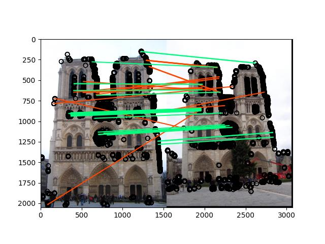
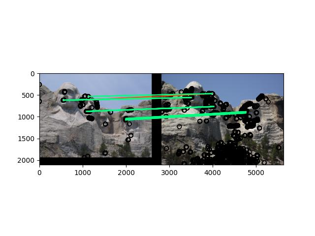
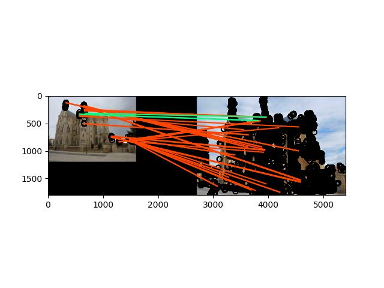

# Introduction

The objective of this project is to perform image recognition through feature extraction and matching. The Harris corner detection algorithm and SIFT (Scale-Invariant Feature Transform) are implemented for matching different images.

# Harris Corner Detection (get_interest_points())

Algorithm:
1. Calculate the x and y direction derivatives using the Sobel operator.
2. Apply a Gaussian filter to the derivatives and calculate the R value using the formula R = ((I_x * I_y - H_xy^2) - k * (I_x + I_y)^2).
3. Use the maximum_filter function to obtain local maxima from the surrounding points.
4. Perform non-maximum suppression by iterating over R. If R[i][j] != 0, append the indexes (i, j) in the y and x directions.
5. Output the obtained indexes in the y and x directions.

# Discussion

The threshold determines the display of interest points in the algorithm. By reducing the threshold, more interest points are shown, which increases the ability to capture valid features and thus improves accuracy. However, this may require more time and memory resources.

# SIFT Descriptor

The SIFT descriptor is a feature extraction algorithm used to identify and describe unique characteristics of an image in a way that is invariant to rotation and illumination changes. The algorithm involves the following steps:
1. Obtain the gradient and orientation of the image.
2. Create a 16x16 grid around each keypoint.
3. Divide the 16x16 grid into 4x4 blocks.
4. Calculate an oriented histogram for each block.
5. Concatenate the histograms of all 16 blocks into a 128-dimensional vector representing the feature.
6. Repeat the process for all keypoints in the image.
The output is a matrix of shape (number of keypoints, 128) where each row represents a feature. The SIFT descriptor is beneficial for object recognition, image stitching, and other computer vision applications.

# Feature Matching

The feature matching process involves several steps to match features between two images. For each feature in the first image, the algorithm calculates the Euclidean distance between that feature and all the features in the second image. The distances are sorted in ascending order. The algorithm then applies a ratio test between the two smallest distances to determine if the match is valid. If the ratio is below a certain threshold (typically 0.8), the match is considered valid and added to the matches list. The algorithm also calculates the confidence of the match and appends it to the corresponding list. The output consists of a vector containing all the matches and a vector containing the confidences of the matches. Feature matching is useful for object recognition, image stitching, and other computer vision applications.

# Results

Notre Dame:
- Matches: 1938
- Accuracy on 50 most confident matches: 60%
- Accuracy on 100 most confident matches: 59%
- Accuracy on all matches: 35%
  

Mt. Rushmore:
- Matches: 150
- Accuracy on 50 most confident matches: 98%
- Accuracy on 100 most confident matches: 91%
- Accuracy on all matches: 90%

E-Gaudi:
- Matches: 125
- Accuracy on 50 most confident matches: 6%
- Accuracy on 100 most confident matches: 7%
- Accuracy on all matches: 10%

